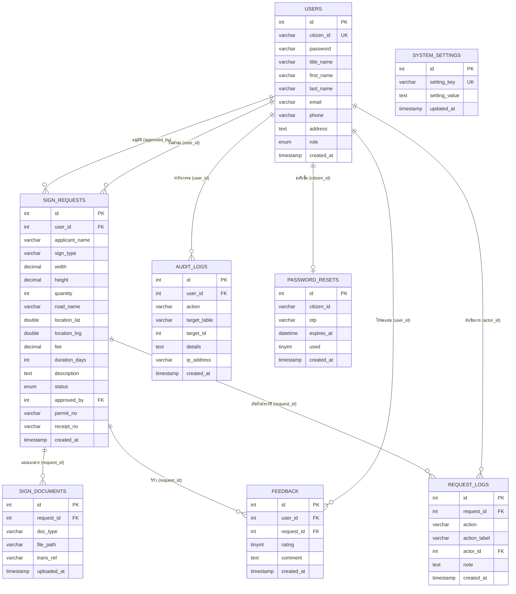

# [cite_start]โครงงาน: การพัฒนาโปรแกรมขออนุญาตติดตั้งป้ายโฆษณาชั่วคราว กรณีศึกษา เทศบาลเมืองศิลา จังหวัดขอนแก่น [cite: 1]

## [cite_start]Development of a Web Application for Temporary Advertising Signage Permit Requests Case Study of Sila Municipality, Khon Kaen Province [cite: 2]

**ข้อมูลผู้จัดทำ**

- [cite_start]**ชื่อนักศึกษา:** นาย รัชชานนท์ อินกันหา 653380070-1 [cite: 3, 4]
- [cite_start]**รายวิชา:** SC334 785 สหกิจศึกษา หลักสูตรภูมิสารสนเทศศาสตร์ [cite: 5]
- [cite_start]**สาขา/คณะ:** สาขาวิชาวิทยาการคอมพิวเตอร์ วิทยาลัยการคอมพิวเตอร์ มหาวิทยาลัยขอนแก่น [cite: 6]
- [cite_start]**ปีการศึกษา:** 2568 [cite: 7]

---

## บทคัดย่อ (Abstract)

โครงงานนี้เป็นการพัฒนาเว็บแอปพลิเคชันสำหรับระบบบริหารจัดการคำร้องขออนุญาตติดตั้งป้ายโฆษณาชั่วคราวในเขตเทศบาลเมืองศิลา จังหวัดขอนแก่น โดยมีวัตถุประสงค์เพื่อเปลี่ยนกระบวนการยื่นคำร้องจากรูปแบบเอกสารกระดาษมาเป็นระบบออนไลน์ ช่วยลดระยะเวลาและค่าใช้จ่ายในการเดินทางของประชาชน ระบบพัฒนาขึ้นด้วยภาษา PHP ร่วมกับฐานข้อมูล MySQL และเว็บเซิร์ฟเวอร์ Apache โดยใช้ Leaflet.js สำหรับแสดงแผนที่เชิงโต้ตอบในการระบุตำแหน่งติดตั้งป้าย พร้อมรองรับไฟล์ GeoJSON เพื่อแสดงขอบเขตเทศบาลเมืองศิลา ระบบรองรับผู้ใช้งาน 3 กลุ่ม ได้แก่ ประชาชน เจ้าหน้าที่ และผู้ดูแลระบบ โดยประชาชนสามารถยื่นคำร้อง อัปโหลดเอกสาร ชำระค่าธรรมเนียมผ่าน QR PromptPay และติดตามสถานะคำร้องได้แบบ Real-time ขณะที่เจ้าหน้าที่สามารถตรวจสอบเอกสาร พิจารณาอนุมัติ ออกใบอนุญาตดิจิทัล และดูรายงานสรุปพร้อมกราฟสถิติผ่านแดชบอร์ด นอกจากนี้ ระบบยังมีการแจ้งเตือนสถานะผ่าน Email และ LINE Notify บันทึกประวัติการดำเนินการ (Audit Log) และระบบประเมินความพึงพอใจเพื่อนำผลไปปรับปรุงการให้บริการ ผลการพัฒนาพบว่าระบบสามารถทำงานได้ตามวัตถุประสงค์ที่กำหนดไว้อย่างครบถ้วน

**คำสำคัญ:** ระบบขออนุญาตป้ายโฆษณา, เว็บแอปพลิเคชัน, ระบบสารสนเทศภูมิศาสตร์, เทศบาลเมืองศิลา, Digital Transformation

## กิตติกรรมประกาศ (Acknowledgements)

โครงงานฉบับนี้สำเร็จลุล่วงได้ด้วยดี เนื่องจากได้รับความอนุเคราะห์และการสนับสนุนจากหลายฝ่าย ผู้จัดทำขอขอบพระคุณอาจารย์ที่ปรึกษาที่ให้คำแนะนำ ชี้แนะแนวทาง และตรวจสอบความถูกต้องของโครงงานตลอดระยะเวลาการดำเนินงาน

ขอขอบคุณเทศบาลเมืองศิลา จังหวัดขอนแก่น ที่ให้โอกาสในการฝึกสหกิจศึกษาและอนุเคราะห์ข้อมูลที่จำเป็นสำหรับการพัฒนาระบบ รวมถึงเจ้าหน้าที่ทุกท่านที่ให้ความร่วมมือในการทดสอบและให้ข้อเสนอแนะ

ขอขอบคุณคณาจารย์สาขาวิชาวิทยาการคอมพิวเตอร์ วิทยาลัยการคอมพิวเตอร์ มหาวิทยาลัยขอนแก่น ที่ประสิทธิ์ประสาทวิชาความรู้ตลอดหลักสูตรการศึกษา

สุดท้ายนี้ ขอขอบคุณครอบครัวและเพื่อน ๆ ที่คอยให้กำลังใจและสนับสนุนในทุกด้านตลอดระยะเวลาการทำโครงงาน

นาย รัชชานนท์ อินกันหา

---

## [cite_start]บทที่ 1: บทนำ [cite: 48]

### [cite_start]1.1 ที่มาและความสำคัญของปัญหา [cite: 49]

[cite_start]ในปัจจุบันการยื่นคำร้องขออนุญาตติดตั้งป้ายโฆษณาในเขตเทศบาลเมืองศิลายังคงใช้รูปแบบการดำเนินการแบบเดิม ซึ่งผู้ยื่นคำร้องจำเป็นต้องเดินทางมายังสำนักงานเทศบาลเพื่อกรอกเอกสารกระดาษ ส่งผลให้เกิดความล่าช้า สิ้นเปลืองทรัพยากร และสร้างภาระค่าใช้จ่ายในการเดินทางให้แก่ประชาชน [cite: 50] [cite_start]นอกจากนี้ การติดตามสถานะคำร้องยังทำได้ยาก ต้องโทรสอบถามหรือเดินทางมาติตต่อด้วยตนเอง และการจัดเก็บข้อมูลในรูปแบบเอกสารยังเสี่ยงต่อการสูญหายและยากต่อการสืบค้น [cite: 50] [cite_start]เพื่อแก้ปัญหาดังกล่าว คณะผู้จัดทำจึงได้พัฒนา "การพัฒนาโปรแกรมระบบบริหารจัดการคำร้องขออนุญาตติดตั้งป้ายโฆษณาออนไลน์" ขึ้น เพื่อเปลี่ยนรูปแบบการทำงานสู่ดิจิทัล (Digital Transformation) โดยนำเทคโนโลยีเว็บแอปพลิเคชันมาช่วยอำนวยความสะดวก ให้ประชาชนสามารถยื่นคำร้อง ระบุพิกัดติดตั้งป้าย และชำระค่าธรรมเนียมได้ผ่านระบบออนไลน์ พร้อมทั้งมีการแจ้งเตือนสถานะผ่าน Email แบบ Real-time ซึ่งจะช่วยยกระดับการให้บริการของเทศบาลให้มีความรวดเร็ว โปร่งใส และมีประสิทธิภาพมากยิ่งขึ้น [cite: 50]

### [cite_start]1.2 วัตถุประสงค์ [cite: 51]

- [cite_start]เพื่อพัฒนาระบบยื่นคำร้องขออนุญาตติดตั้งป้ายโฆษณาผ่านอินเทอร์เน็ต ลดความจำเป็นในการเดินทาง [cite: 52]
- [cite_start]เพื่ออำนวยความสะดวกให้ประชาชนสามารถติดตามสถานะการดำเนินการได้ด้วยตนเองตลอดเวลา [cite: 53]
- [cite_start]เพื่อนำเทคโนโลยีแผนที่ภูมิศาสตร์ มาประยุกต์ใช้ในการระบุตำแหน่งของป้าย [cite: 54]

### [cite_start]1.3 สถานที่ทำวิจัย [cite: 55]

- [cite_start]เขตเทศบาลเมืองศิลา จังหวัดขอนแก่น [cite: 56]

### [cite_start]1.4 ผลที่คาดว่าจะได้รับ [cite: 57]

- [cite_start]ได้ระบบสารสนเทศที่ช่วยลดระยะเวลาและขั้นตอนในการยื่นคำร้องขอติดตั้งป้าย [cite: 58]
- [cite_start]ประะชาชนมีความพึงพอใจในการรับบริการที่สะดวกรวดเร็วและตรวจสอบได้ [cite: 59]

---

## บทที่ 2: ทฤษฎีและงานวิจัยที่เกี่ยวข้อง

### 2.1 ระบบสารสนเทศภูมิศาสตร์ (Geographic Information System: GIS)
ระบบสารสนเทศภูมิศาสตร์ หรือ GIS คือ ระบบที่ออกแบบมาเพื่อจัดเก็บ จัดการ วิเคราะห์ และนำเสนอข้อมูลเชิงพื้นที่ (Spatial Data) โดยสามารถเชื่อมโยงข้อมูลเชิงบรรยาย (Attribute Data) เข้ากับข้อมูลตำแหน่งทางภูมิศาสตร์ได้ (กรมแผนที่ทหาร, 2563) ในโครงงานนี้ได้นำ GIS มาประยุกต์ใช้ผ่าน Library ชื่อ Leaflet.js ซึ่งเป็น JavaScript Library แบบ Open-source สำหรับแสดงแผนที่เชิงโต้ตอบ (Interactive Map) บนเว็บเบราว์เซอร์ รองรับการแสดงผลข้อมูล GeoJSON เพื่อกำหนดขอบเขตพื้นที่ให้บริการของเทศบาลเมืองศิลา และให้ผู้ใช้สามารถปักหมุดระบุตำแหน่งติดตั้งป้ายบนแผนที่ได้โดยตรง

### 2.2 เว็บแอปพลิเคชัน (Web Application)
เว็บแอปพลิเคชัน คือ โปรแกรมประยุกต์ที่ทำงานบนเว็บเบราว์เซอร์ผ่านเครือข่ายอินเทอร์เน็ต โดยไม่จำเป็นต้องติดตั้งซอฟต์แวร์เพิ่มเติมบนเครื่องของผู้ใช้ (Shklar & Rosen, 2009) เว็บแอปพลิเคชันทำงานบนสถาปัตยกรรมแบบ Client-Server กล่าวคือ ฝั่ง Client (เว็บเบราว์เซอร์) ทำหน้าที่แสดงผลส่วนติดต่อผู้ใช้ (User Interface) ส่วนฝั่ง Server ทำหน้าที่ประมวลผลข้อมูลและติดต่อกับฐานข้อมูล ข้อดีของเว็บแอปพลิเคชัน คือ สามารถเข้าถึงได้จากทุกอุปกรณ์ที่มีเว็บเบราว์เซอร์ อัปเดตได้ง่าย และไม่ต้องดูแลรักษาซอฟต์แวร์ฝั่งผู้ใช้

### 2.3 ภาษา PHP (Hypertext Preprocessor)
PHP เป็นภาษาสคริปต์ฝั่งเซิร์ฟเวอร์ (Server-side Scripting Language) ที่ได้รับความนิยมอย่างแพร่หลายในการพัฒนาเว็บแอปพลิเคชัน เนื่องจากมีความยืดหยุ่นสูง เรียนรู้ได้ง่าย และรองรับการเชื่อมต่อกับฐานข้อมูลหลายประเภท โดยเฉพาะ MySQL (The PHP Group, 2024) ในโครงงานนี้ใช้ PHP สำหรับจัดการทุกกระบวนการฝั่งเซิร์ฟเวอร์ ตั้งแต่การยืนยันตัวตน การจัดการคำร้อง การสร้างเอกสาร ไปจนถึงการส่งอีเมลแจ้งเตือน

### 2.4 ระบบจัดการฐานข้อมูล MySQL
MySQL เป็นระบบจัดการฐานข้อมูลเชิงสัมพันธ์ (Relational Database Management System: RDBMS) แบบ Open-source ที่ได้รับความนิยมสูงสุดสำหรับเว็บแอปพลิเคชัน (Oracle Corporation, 2024) MySQL ใช้ภาษา SQL (Structured Query Language) ในการจัดการข้อมูล รองรับ Prepared Statements เพื่อป้องกัน SQL Injection และมีประสิทธิภาพสูงในการจัดการข้อมูลจำนวนมาก ในโครงงานนี้ MySQL ถูกใช้เป็นฐานข้อมูลหลักสำหรับจัดเก็บข้อมูลผู้ใช้ คำร้อง เอกสาร และบันทึกการดำเนินการทั้งหมด

### 2.5 Bootstrap Framework
Bootstrap เป็น CSS Framework แบบ Open-source ที่ช่วยให้การพัฒนาส่วนติดต่อผู้ใช้ (User Interface) เป็นไปอย่างรวดเร็วและมีมาตรฐาน โดยมีระบบ Grid System สำหรับจัดวาง Layout แบบ Responsive ที่รองรับการแสดงผลบนอุปกรณ์หลายขนาด พร้อมส่วนประกอบ (Component) สำเร็จรูป เช่น ปุ่ม การ์ด ตาราง และฟอร์ม (Bootstrap Team, 2024)

### 2.6 GeoJSON
GeoJSON เป็นรูปแบบมาตรฐานเปิด (Open Standard) สำหรับแลกเปลี่ยนข้อมูลเชิงพื้นที่ในรูปแบบ JSON (JavaScript Object Notation) รองรับข้อมูลประเภท Point, LineString, Polygon และ MultiPolygon (Butler et al., 2016) ในโครงงานนี้ใช้ไฟล์ GeoJSON 2 ไฟล์ ได้แก่ `sila.geojson` สำหรับแสดงขอบเขตเทศบาลเมืองศิลา และ `road_sila.geojson` สำหรับแสดงเส้นทางถนนบนแผนที่

### 2.7 วงจรการพัฒนาระบบ (System Development Life Cycle: SDLC)
SDLC เป็นกระบวนการในการพัฒนาระบบสารสนเทศอย่างมีขั้นตอนและเป็นระบบ ประกอบด้วยขั้นตอนหลัก ได้แก่ การศึกษาปัญหา การวิเคราะห์ระบบ การออกแบบ การพัฒนา การทดสอบ และการบำรุงรักษา (Pressman, 2014) การใช้ SDLC ช่วยให้การพัฒนาระบบเป็นไปอย่างมีแบบแผน ลดความเสี่ยงในการเกิดข้อผิดพลาด และทำให้ระบบที่พัฒนาขึ้นตรงตามความต้องการของผู้ใช้

### 2.8 งานวิจัยที่เกี่ยวข้อง

**วิชิต ศรีเสมอ (2564)** ได้ศึกษาการพัฒนาระบบสารสนเทศเพื่อการจัดการใบอนุญาตออนไลน์ ผลการศึกษาพบว่าระบบออนไลน์ช่วยลดระยะเวลาในการดำเนินการได้อย่างมีนัยสำคัญ และเพิ่มความพึงพอใจของผู้ใช้บริการ

**สุนทร วงศ์สุวรรณ (2565)** ได้พัฒนาเว็บแอปพลิเคชันสำหรับการบริหารจัดการงานอนุญาตก่อสร้างในเขตเทศบาล โดยใช้เทคโนโลยี PHP และ MySQL ร่วมกับ Google Maps API ผลการวิจัยพบว่าระบบช่วยลดขั้นตอนการทำงานและเพิ่มประสิทธิภาพในการติดตามสถานะคำขอ

**ณัฐพล จันทร์เพ็ง (2565)** ได้ศึกษาการประยุกต์ใช้ระบบสารสนเทศภูมิศาสตร์ในการจัดการป้ายโฆษณาในเขตเมือง ผลการศึกษาพบว่า GIS สามารถช่วยในการวิเคราะห์ตำแหน่งและการกระจายตัวของป้ายโฆษณาได้อย่างมีประสิทธิภาพ ทำให้การบริหารจัดการมีความเป็นระบบมากขึ้น

---

## [cite_start]บทที่ 3: วิธีการดำเนินการศึกษา [cite: 65, 66]

### [cite_start]3.1 พื้นที่ศึกษา [cite: 67]

[cite_start][แนบรูปภาพ: ภาพที่ 1 แสดงพื้นที่ศึกษา เขตเทศบาลเมืองศิลา] [cite: 68]

### 3.2 ข้อมูลและเครื่องมือที่ใช้

#### 3.2.1 ส่วนติดต่อผู้ใช้งาน (Frontend)

- **HTML5, CSS3 และ JavaScript** — โครงสร้างหน้าเว็บ การจัดรูปแบบ และการโต้ตอบ
- **Bootstrap 5** — CSS Framework สำหรับออกแบบ Responsive UI
- **Leaflet.js** — Library สำหรับแสดงแผนที่เชิงโต้ตอบ (Interactive Map) พร้อมรองรับ GeoJSON
- **Chart.js** — Library สำหรับสร้างกราฟแสดงสถิติ (Bar Chart, Doughnut Chart)
- **SweetAlert2** — Library สำหรับแสดงกล่องข้อความแจ้งเตือนแบบสวยงาม
- **Bootstrap Icons** — ไอคอนสำหรับส่วนติดต่อผู้ใช้

#### 3.2.2 ส่วนประมวลผล (Backend)

- **ภาษา PHP** — เขียนคำสั่งควบคุมการทำงานของระบบทั้งหมด
- **PHPMailer (SMTP)** — ส่งอีเมลแจ้งเตือนสถานะคำร้องแบบ Real-time
- **LINE Notify API** — แจ้งเตือนผ่านแอปพลิเคชัน LINE

#### 3.2.3 ระบบจัดการฐานข้อมูล

- **MySQL** — จัดเก็บข้อมูลผู้ใช้ คำร้อง เอกสาร และบันทึกการทำงานของระบบ

#### 3.2.4 เว็บเซิร์ฟเวอร์

- **Apache (XAMPP)** — จำลองสภาพแวดล้อมการทำงานของระบบบนเครื่อง Local

#### 3.2.5 ข้อมูลภูมิสารสนเทศ

- **GeoJSON** — ไฟล์ขอบเขตเทศบาลเมืองศิลา (`sila.geojson`) และเส้นทางถนน (`road_sila.geojson`) สำหรับแสดงขอบเขตพื้นที่ให้บริการบนแผนที่
- **MapTiler API** — ให้บริการแผนที่ดาวเทียม (Hybrid) และแผนที่ถนน (Streets)

### [cite_start]3.3 ขั้นตอนการดำเนินงาน [cite: 74]

[cite_start]ผู้จัดทำได้กำหนดขั้นตอนการพัฒนาตามวงจรการพัฒนาระบบ (System Development Life Cycle) ดังนี้ [cite: 76]

1. [cite_start]**ศึกษาปัญหาและรวบรวมข้อมูล:** ศึกษากระบวนการยื่นคำร้องแบบเดิมและรวบรวมความต้องการจากผู้เกี่ยวข้อง [cite: 77]
2. [cite_start]**วิเคราะห์ระบบและกำหนดขอบเขต:** นำข้อมูลที่ได้มาวิเคราะห์เพื่อกำหนดขอบเขตความสามารถของเว็บแอปพลิเคชัน [cite: 78]
3. [cite_start]**ออกแบบระบบ:** จัดทำโครงสร้างข้อมูล (ER-Diagram), ลำดับการทำงาน (Flowchart) และการออกแบบส่วนติดต่อผู้ใช้ (UI Design) [cite: 79]
4. [cite_start]**พัฒนาระบบ:** ดำเนินการเขียนโปรแกรมในส่วน Frontend, Backend และจัดทำฐานข้อมูลตามที่ออกแบบไว้ [cite: 80]
5. [cite_start]**ทดสอบระบบ:** ตรวจสอบการทำงานของระบบเพื่อให้แน่ใจว่าทำงานได้ถูกต้องตามวัตถุประสงค์ [cite: 81]
6. [cite_start]**ปรับปรุงแก้ไข:** นำข้อผิดพลาดที่พบจากการทดสอบมาดำเนินการแก้ไขให้สมบูรณ์ [cite: 82]
7. [cite_start]**ประเมินผล:** สรุปผลการดำเนินงานและประสิทธิภาพของระบบ [cite: 83]
   [cite_start]_[แนบรูปภาพ: ภาพที่ 2 Flowchart ขั้นตอนการดำเนินงาน]_ [cite: 75]

### [cite_start]3.4 สถาปัตยกรรม [cite: 84]

[cite_start]ระบบถูกออกแบบภายใต้สถาปัตยกรรมแบบ Client-Server โดยผู้ใช้งาน (User) จะส่งคำขอผ่านเว็บเบราว์เซอร์ (Client) ไปยังเซิร์ฟเวอร์ (Server) ซึ่งเซิร์ฟเวอร์จะทำหน้าที่ประมวลผลผ่านภาษา PHP และติดต่อกับฐานข้อมูล MySQL เพื่อดึงหรือบันทึกข้อมูลคำร้อง [cite: 85]
[cite_start]_[แนบรูปภาพ: ภาพที่ 3 สถาปัตยกรรม Client-Server]_ [cite: 86]

### 3.5 การออกแบบฐานข้อมูล (ER-Diagram)

ฐานข้อมูลของระบบประกอบด้วย **8 ตาราง** เพื่อใช้ในการบริหารจัดการข้อมูลอย่างเป็นระบบ ดังนี้



#### รายละเอียดแต่ละตาราง

| ลำดับ | ชื่อตาราง           | หน้าที่                                                                                                                                    | ความสัมพันธ์                      |
| ----- | ------------------- | ------------------------------------------------------------------------------------------------------------------------------------------ | --------------------------------- |
| 1     | **users**           | จัดเก็บข้อมูลส่วนบุคคลของผู้ใช้งาน เช่น ชื่อ-นามสกุล, เลขบัตรประชาชน, เบอร์โทรศัพท์ และบทบาทหน้าที่ (Role: admin, employee, user)          | เชื่อมโยงกับทุกตาราง              |
| 2     | **sign_requests**   | จัดเก็บรายละเอียดคำร้องขออนุญาตทั้งหมด ตั้งแต่ประเภทป้าย, ขนาด, พิกัดตำแหน่ง (Lat/Lng), ค่าธรรมเนียม, สถานะ ตลอดจนข้อมูลใบเสร็จและใบอนุญาต | FK → users (ผู้ยื่น + ผู้อนุมัติ) |
| 3     | **sign_documents**  | จัดเก็บไฟล์เอกสารแนบ เช่น สำเนาบัตรประชาชน, แผนผังป้าย, สลิปการชำระเงิน                                                                    | FK → sign_requests                |
| 4     | **request_logs**    | บันทึกประวัติการเปลี่ยนแปลงสถานะของแต่ละคำร้อง ใช้แสดงเป็น Timeline                                                                        | FK → sign_requests, users         |
| 5     | **audit_logs**      | บันทึกกิจกรรมสำคัญทั้งหมดในระบบ (Login, อนุมัติ, ปฏิเสธ) เพื่อตรวจสอบย้อนหลัง                                                              | FK → users                        |
| 6     | **feedback**        | จัดเก็บคะแนนความพึงพอใจ (1-5 ดาว) และความคิดเห็นจากประชาชน                                                                                 | FK → users, sign_requests         |
| 7     | **password_resets** | จัดเก็บ OTP สำหรับกรณีลืมรหัสผ่าน พร้อมเวลาหมดอายุ                                                                                         | อ้างอิง citizen_id → users        |
| 8     | **system_settings** | จัดเก็บค่าตั้งระบบ เช่น ชื่อผู้ลงนามใบอนุญาต, PromptPay ID                                                                                 | ไม่มี FK โดยตรง                   |

#### สถานะของคำร้อง (Status Flow)

คอลัมน์ `status` ในตาราง `sign_requests` มีค่าที่เป็นไปได้ดังนี้

```
pending → reviewing → waiting_payment → waiting_permit → approved
              ↓
         need_documents
              ↓
           rejected
```

| สถานะ             | ความหมาย                      |
| ----------------- | ----------------------------- |
| `pending`         | รอพิจารณา (ยื่นใหม่)          |
| `reviewing`       | เจ้าหน้าที่กำลังตรวจสอบ       |
| `need_documents`  | ขอเอกสารเพิ่มเติม             |
| `waiting_payment` | รอชำระค่าธรรมเนียม            |
| `waiting_permit`  | รอออกใบอนุญาต                 |
| `approved`        | อนุมัติแล้ว (ออกใบอนุญาตแล้ว) |
| `rejected`        | ปฏิเสธ                        |

_[แนบรูปภาพ: ภาพที่ 4 ER-Diagram]_

### 3.6 การใช้งานระบบ (Use Case)

ระบบถูกออกแบบให้รองรับผู้ใช้งาน 3 กลุ่มหลัก คือ ประชาชน, เจ้าหน้าที่ และผู้ดูแลระบบ โดยแต่ละกลุ่มมีความสามารถดังนี้

**ประชาชน (User):**

- สมัครสมาชิก / เข้าสู่ระบบด้วยเลขบัตรประชาชน
- ยื่นคำร้องขออนุญาตติดตั้งป้าย พร้อมระบุตำแหน่งผ่านแผนที่ GIS
- อัปโหลดเอกสารประกอบ (สำเนาบัตร, แผนผัง, รูปถ่าย)
- ติดตามสถานะคำร้องแบบ Real-time พร้อม Timeline ประวัติการดำเนินการ
- ชำระค่าธรรมเนียมผ่านระบบ (สแกน QR PromptPay + อัปโหลดสลิป)
- ดาวน์โหลดใบเสร็จรับเงินและใบอนุญาต (PDF)
- ต่ออายุใบอนุญาตเมื่อใกล้หมดอายุ
- ให้คะแนนความพึงพอใจและแสดงความคิดเห็น
- รีเซ็ตรหัสผ่านผ่าน OTP ทางอีเมล

**เจ้าหน้าที่ (Employee):**

- ดูแดชบอร์ดสรุปสถิติคำร้อง (กราฟ, ตัวเลข)
- ตรวจสอบเอกสารและพิจารณาอนุมัติ/ปฏิเสธคำร้อง
- แจ้งขอเอกสารเพิ่มเติมในกรณีที่ไม่สมบูรณ์
- ออกใบอนุญาตดิจิทัลพร้อมเลขที่อัตโนมัติ
- ดูรายงานสรุป (รายเดือน, รายปี) พร้อม Export CSV
- ตรวจสอบป้ายใกล้หมดอายุ
- ตั้งค่าผู้ลงนามใบเสร็จ/ใบอนุญาต

**ผู้ดูแลระบบ (Admin):**

- มีสิทธิ์เทียบเท่าเจ้าหน้าที่ทั้งหมด
- เพิ่ม/ลบ/แก้ไขผู้ใช้งานในระบบ
- เปลี่ยนบทบาท (Role) ของผู้ใช้
- ตรวจสอบ Audit Log (ประวัติการใช้งานระบบ)

_[แนบรูปภาพ: ภาพที่ 5 Use Case Diagram]_

---

## บทที่ 4: ผลการวิจัย

จากการพัฒนาเว็บแอปพลิเคชันระบบบริหารจัดการคำร้องขออนุญาตติดตั้งป้ายโฆษณาชั่วคราว สามารถสรุปผลการพัฒนาแบ่งตามส่วนการทำงานได้ดังนี้

### 4.1 ส่วนการลงทะเบียนและยืนยันตัวตน

ระบบรองรับการสมัครสมาชิกด้วยเลขบัตรประชาชน 13 หลัก โดยมีการตรวจสอบรูปแบบข้อมูลอัตโนมัติ ผู้ใช้สามารถเข้าสู่ระบบด้วยเลขบัตรประชาชนและรหัสผ่าน ระบบมีฟังก์ชันลืมรหัสผ่าน ซึ่งจะส่ง OTP 6 หลักไปยังอีเมลที่ลงทะเบียนไว้ โดย OTP มีอายุการใช้งานจำกัดเพื่อความปลอดภัย

*[แนบรูปภาพ: ภาพที่ 6 หน้าจอเข้าสู่ระบบ]*
*[แนบรูปภาพ: ภาพที่ 7 หน้าจอสมัครสมาชิก]*

### 4.2 ส่วนการยื่นคำร้อง

ประชาชนสามารถกรอกแบบฟอร์มยื่นคำร้องออนไลน์ ประกอบด้วย ข้อมูลผู้ขอ ประเภทป้าย ขนาด จำนวน และสถานที่ติดตั้ง โดยมีฟีเจอร์สำคัญดังนี้

- **แผนที่เชิงโต้ตอบ (Interactive Map):** ผู้ใช้สามารถปักหมุดระบุตำแหน่งติดตั้งป้ายบนแผนที่ Leaflet.js โดยระบบจะแสดงขอบเขตเทศบาลเมืองศิลาผ่านไฟล์ GeoJSON และตรวจสอบอัตโนมัติว่าตำแหน่งที่ปักหมุดอยู่ในเขตพื้นที่ให้บริการหรือไม่ หากอยู่นอกเขตจะแจ้งเตือนและไม่อนุญาตให้ยื่นคำร้อง
- **อัปโหลดเอกสาร:** รองรับการอัปโหลดเอกสารแนบ เช่น สำเนาบัตรประชาชน แผนผังป้าย และรูปถ่ายสถานที่
- **คำนวณค่าธรรมเนียม:** ระบบคำนวณค่าธรรมเนียมอัตโนมัติจากขนาดและประเภทป้าย

*[แนบรูปภาพ: ภาพที่ 8 หน้าจอแบบฟอร์มยื่นคำร้อง]*
*[แนบรูปภาพ: ภาพที่ 9 หน้าจอแผนที่ระบุตำแหน่ง]*

### 4.3 ส่วนการติดตามสถานะ

ประชาชนสามารถเข้าดูรายการคำร้องทั้งหมดของตนเอง โดยแต่ละคำร้องจะแสดงสถานะปัจจุบันด้วย Badge สีที่แตกต่างกัน เมื่อคลิกเข้าดูรายละเอียด จะพบ Timeline แสดงประวัติการดำเนินการทุกขั้นตอน พร้อมระบุวันที่ เวลา และผู้ดำเนินการ นอกจากนี้ ระบบจะส่งอีเมลแจ้งเตือนอัตโนมัติทุกครั้งที่มีการเปลี่ยนแปลงสถานะ

*[แนบรูปภาพ: ภาพที่ 10 หน้าจอรายการคำร้อง]*
*[แนบรูปภาพ: ภาพที่ 11 หน้าจอ Timeline การดำเนินการ]*

### 4.4 ส่วนการชำระค่าธรรมเนียม

เมื่อคำร้องได้รับการอนุมัติเบื้องต้น สถานะจะเปลี่ยนเป็น "รอชำระเงิน" ระบบจะแสดง QR Code สำหรับสแกนจ่ายผ่าน PromptPay พร้อมจำนวนเงินค่าธรรมเนียมที่ต้องชำระ ผู้ใช้สามารถอัปโหลดสลิปการโอนเงินเข้าสู่ระบบ โดยระบบจะบันทึกหมายเลขอ้างอิงธุรกรรม (Transaction Reference) เพื่อการตรวจสอบ

*[แนบรูปภาพ: ภาพที่ 12 หน้าจอชำระค่าธรรมเนียม]*

### 4.5 ส่วนเจ้าหน้าที่ (Employee Dashboard)

เจ้าหน้าที่มีแดชบอร์ดแสดงภาพรวมของระบบ ประกอบด้วย

- **การ์ดสถิติ:** แสดงจำนวนคำร้องแยกตามสถานะ (รอพิจารณา, รอเอกสาร, รอชำระเงิน, รอใบอนุญาต, อนุมัติแล้ว)
- **กราฟแท่ง:** แสดงจำนวนคำร้องรายเดือนย้อนหลัง 6 เดือน (Chart.js)
- **กราฟวงกลม:** แสดงสัดส่วนคำร้องแยกตามสถานะ
- **ตารางคำร้องล่าสุด:** แสดงรายการ 5 คำร้องล่าสุดพร้อมลิงก์เข้าดูรายละเอียด

เจ้าหน้าที่สามารถจัดการคำร้องได้ ได้แก่ ตรวจสอบเอกสาร พิจารณาอนุมัติหรือปฏิเสธ แจ้งขอเอกสารเพิ่มเติม ออกใบเสร็จรับเงิน และออกใบอนุญาตดิจิทัลพร้อมเลขที่อัตโนมัติ

*[แนบรูปภาพ: ภาพที่ 13 หน้าจอแดชบอร์ดเจ้าหน้าที่]*
*[แนบรูปภาพ: ภาพที่ 14 หน้าจอพิจารณาอนุมัติคำร้อง]*
*[แนบรูปภาพ: ภาพที่ 15 หน้าจอออกใบอนุญาต]*

### 4.6 ส่วนรายงานและสถิติ

ระบบรายงานรองรับการกรองข้อมูลตามปีและเดือน แสดงผลในรูปแบบ

- สถิติสรุป (การ์ดตัวเลข): จำนวนคำร้องทั้งหมด แยกตามสถานะ และยอดค่าธรรมเนียมรวม
- กราฟแท่งรายเดือน: แสดงแนวโน้มจำนวนคำร้องตลอดทั้งปี
- กราฟวงกลม: แสดงสัดส่วนตามประเภทป้ายและสถานะ
- ตารางป้ายใกล้หมดอายุ: แสดงรายการป้ายที่ใบอนุญาตจะหมดอายุภายใน 30 วัน
- ส่งออก CSV: สามารถ Export ข้อมูลเป็นไฟล์ CSV สำหรับนำไปวิเคราะห์เพิ่มเติม

*[แนบรูปภาพ: ภาพที่ 16 หน้าจอรายงาน]*

### 4.7 ส่วนแผนที่ภาพรวม

ระบบแสดงแผนที่ภาพรวมแสดงตำแหน่งป้ายทั้งหมดในเขตเทศบาลเมืองศิลา โดยแต่ละตำแหน่งจะแสดงเป็น Marker บนแผนที่ พร้อมป๊อปอัปแสดงรายละเอียดเมื่อคลิก สามารถสลับระหว่างแผนที่ถนน (Streets) และแผนที่ดาวเทียม (Hybrid) ได้

*[แนบรูปภาพ: ภาพที่ 17 หน้าจอแผนที่ภาพรวม]*

### 4.8 ส่วนผู้ดูแลระบบ (Admin)

ผู้ดูแลระบบมีสิทธิ์เพิ่มเติมจากเจ้าหน้าที่ ได้แก่

- จัดการผู้ใช้งาน: เพิ่ม แก้ไข ลบ และเปลี่ยนบทบาท (Role) ของผู้ใช้
- Audit Log: ตรวจสอบประวัติการใช้งานระบบทั้งหมด เช่น การเข้าสู่ระบบ การอนุมัติ/ปฏิเสธ

*[แนบรูปภาพ: ภาพที่ 18 หน้าจอจัดการผู้ใช้]*

### 4.9 ระบบแจ้งเตือน

ระบบแจ้งเตือนทำงาน 2 ช่องทาง

- **Email (PHPMailer/SMTP):** ส่งอีเมลอัตโนมัติทุกครั้งที่มีการเปลี่ยนสถานะ เช่น แจ้งผลการพิจารณา แจ้งให้ชำระเงิน แจ้งออกใบอนุญาต
- **LINE Notify:** ส่งข้อความแจ้งเตือนผ่าน LINE เพื่อให้ผู้ใช้ไม่พลาดข้อมูลสำคัญ

### 4.10 ระบบความพึงพอใจ (Feedback)

หลังจากคำร้องเสร็จสิ้น ประชาชนสามารถให้คะแนนความพึงพอใจ (1-5 ดาว) พร้อมแสดงความคิดเห็น เพื่อเป็นข้อมูลให้เทศบาลนำไปปรับปรุงการให้บริการ

---

## บทที่ 5: สรุป อภิปรายผล และข้อเสนอแนะ

### 5.1 สรุป

จากการพัฒนาเว็บแอปพลิเคชันระบบบริหารจัดการคำร้องขออนุญาตติดตั้งป้ายโฆษณาชั่วคราว กรณีศึกษาเทศบาลเมืองศิลา จังหวัดขอนแก่น สามารถสรุปผลตามวัตถุประสงค์ที่กำหนดไว้ได้ดังนี้

**วัตถุประสงค์ที่ 1:** เพื่อพัฒนาระบบยื่นคำร้องขออนุญาตติดตั้งป้ายโฆษณาผ่านอินเทอร์เน็ต ลดความจำเป็นในการเดินทาง
- ระบบสามารถรองรับการยื่นคำร้องออนไลน์ได้อย่างครบถ้วน ตั้งแต่การกรอกข้อมูล อัปโหลดเอกสาร ชำระค่าธรรมเนียม ไปจนถึงการรับใบอนุญาตในรูปแบบดิจิทัล ประชาชนไม่จำเป็นต้องเดินทางมายังสำนักงานเทศบาล

**วัตถุประสงค์ที่ 2:** เพื่ออำนวยความสะดวกให้ประชาชนสามารถติดตามสถานะการดำเนินการได้ด้วยตนเองตลอดเวลา
- ระบบมี Timeline แสดงประวัติการดำเนินการทุกขั้นตอน พร้อมระบบแจ้งเตือนผ่าน Email และ LINE Notify แบบ Real-time ทำให้ประชาชนทราบความคืบหน้าได้ทันที

**วัตถุประสงค์ที่ 3:** เพื่อนำเทคโนโลยีแผนที่ภูมิศาสตร์มาประยุกต์ใช้ในการระบุตำแหน่งของป้าย
- ระบบใช้ Leaflet.js ร่วมกับ GeoJSON แสดงแผนที่เชิงโต้ตอบ ให้ผู้ใช้สามารถปักหมุดระบุตำแหน่งติดตั้งป้ายได้โดยตรง พร้อมตรวจสอบอัตโนมัติว่าอยู่ในเขตพื้นที่ให้บริการหรือไม่ และแผนที่ภาพรวมแสดงการกระจายตัวของป้ายทั้งหมด

โดยสรุป ระบบที่พัฒนาขึ้นสามารถบรรลุวัตถุประสงค์ทั้ง 3 ข้อ และมีฟังก์ชันเสริมเพิ่มเติม เช่น ระบบประเมินความพึงพอใจ รายงานสถิติ และ Audit Log สำหรับตรวจสอบย้อนหลัง

### 5.2 อภิปรายผล

จากผลการพัฒนาระบบ สามารถอภิปรายประเด็นสำคัญได้ดังนี้

**ข้อดีของระบบ:**
- **ลดขั้นตอนและระยะเวลา:** ประชาชนสามารถดำเนินการทุกขั้นตอนผ่านระบบออนไลน์ได้ตลอด 24 ชั่วโมง ไม่จำกัดเฉพาะเวลาราชการ
- **ความโปร่งใส:** ระบบ Timeline และ Audit Log ช่วยให้ทุกขั้นตอนสามารถตรวจสอบย้อนหลังได้ ลดปัญหาเรื่องความไม่โปร่งใสในการพิจารณา
- **การนำ GIS มาใช้:** การระบุตำแหน่งผ่านแผนที่ช่วยให้เจ้าหน้าที่เห็นภาพรวมของการกระจายตัวป้ายในพื้นที่ได้ชัดเจน
- **การแจ้งเตือนอัตโนมัติ:** Email และ LINE Notify ช่วยให้ผู้ใช้ไม่พลาดข้อมูลสำคัญ ลดภาระในการโทรสอบถาม
- **เอกสารดิจิทัล:** ใบเสร็จและใบอนุญาตในรูปแบบ PDF ช่วยลดการใช้กระดาษและเก็บรักษาได้ง่าย

**ข้อจำกัดของระบบ:**
- ระบบยังคงต้องการอินเทอร์เน็ตในการใช้งาน ซึ่งอาจเป็นอุปสรรคสำหรับผู้ที่ไม่สามารถเข้าถึงอินเทอร์เน็ตได้
- การตรวจสอบสลิปการชำระเงินยังต้องอาศัยการตรวจสอบด้วยเจ้าหน้าที่ ยังไม่มีระบบ Payment Gateway ที่ตรวจสอบอัตโนมัติ
- ระบบยังไม่รองรับการใช้งานหลายภาษา (Multi-language)
- การระบุตำแหน่งบนแผนที่ต้องอาศัยความแม่นยำของผู้ใช้ในการปักหมุด

### 5.3 ข้อเสนอแนะ

**ข้อเสนอแนะเพื่อการพัฒนาต่อยอด:**
1. **Payment Gateway:** เชื่อมต่อกับระบบชำระเงินอัตโนมัติ เช่น Thai QR Payment Standard เพื่อลดขั้นตอนการตรวจสอบสลิปด้วยตนเอง
2. **Mobile Application:** พัฒนาแอปพลิเคชันบนสมาร์ทโฟน (iOS/Android) เพื่อเพิ่มความสะดวกในการใช้งาน
3. **ระบบ OCR:** นำเทคโนโลยี Optical Character Recognition มาช่วยอ่านข้อมูลจากเอกสารที่อัปโหลด เพื่อกรอกข้อมูลอัตโนมัติ
4. **Dashboard ขั้นสูง:** เพิ่มการวิเคราะห์เชิงลึก เช่น แนวโน้มการขออนุญาต พื้นที่ที่มีการติดตั้งป้ายหนาแน่น (Heat Map)
5. **ระบบนัดหมาย:** เพิ่มฟังก์ชันนัดหมายวันตรวจสอบป้ายหน้างาน เชื่อมกับปฏิทินของเจ้าหน้าที่
6. **Multi-language Support:** รองรับภาษาอังกฤษสำหรับผู้ยื่นคำร้องชาวต่างชาติ
7. **API สำหรับหน่วยงานอื่น:** พัฒนา RESTful API เพื่อให้หน่วยงานอื่นในเทศบาลสามารถเชื่อมต่อข้อมูลได้

---

## บรรณานุกรม

1. กรมแผนที่ทหาร. (2563). *ระบบสารสนเทศภูมิศาสตร์เบื้องต้น*. กรุงเทพมหานคร: กรมแผนที่ทหาร.
2. วิชิต ศรีเสมอ. (2564). การพัฒนาระบบสารสนเทศเพื่อการจัดการใบอนุญาตออนไลน์ของเทศบาล. *วารสารเทคโนโลยีสารสนเทศ*, 17(2), 45-56.
3. สุนทร วงศ์สุวรรณ. (2565). การพัฒนาเว็บแอปพลิเคชันสำหรับการบริหารจัดการงานอนุญาตก่อสร้างในเขตเทศบาล. *วารสารวิทยาการคอมพิวเตอร์*, 12(1), 23-35.
4. ณัฐพล จันทร์เพ็ง. (2565). การประยุกต์ใช้ระบบสารสนเทศภูมิศาสตร์ในการจัดการป้ายโฆษณาในเขตเมือง. *วารสารภูมิสารสนเทศ*, 8(3), 78-91.
5. Bootstrap Team. (2024). *Bootstrap 5 Documentation*. Retrieved from https://getbootstrap.com/docs/5.3/
6. Butler, H., Daly, M., Doyle, A., Gillies, S., Hagen, S., & Schaub, T. (2016). *The GeoJSON Format (RFC 7946)*. Internet Engineering Task Force (IETF).
7. Leaflet Contributors. (2024). *Leaflet: An Open-Source JavaScript Library for Interactive Maps*. Retrieved from https://leafletjs.com/
8. Oracle Corporation. (2024). *MySQL 8.0 Reference Manual*. Retrieved from https://dev.mysql.com/doc/refman/8.0/en/
9. Pressman, R.S. (2014). *Software Engineering: A Practitioner's Approach* (8th ed.). McGraw-Hill Education.
10. Shklar, L., & Rosen, R. (2009). *Web Application Architecture: Principles, Protocols and Practices* (2nd ed.). John Wiley & Sons.
11. The PHP Group. (2024). *PHP Manual*. Retrieved from https://www.php.net/manual/en/

---

## [cite_start]ภาคผนวก [cite: 110]

- [cite_start]**ภาคผนวก ก:** พจนานุกรมข้อมูล [cite: 111]
- [cite_start]**ภาคผนวก ข:** ชุดคำสั่ง* [cite: 112]
  [cite_start]*(_ หมายเหตุ: แต่ละหมวดต้องแยกเป็น ภาคผนวก ค ภาพประกอบ, ภาคผนวก ง แบบสัมภาษณ์ เป็นต้น)_ [cite: 113]
